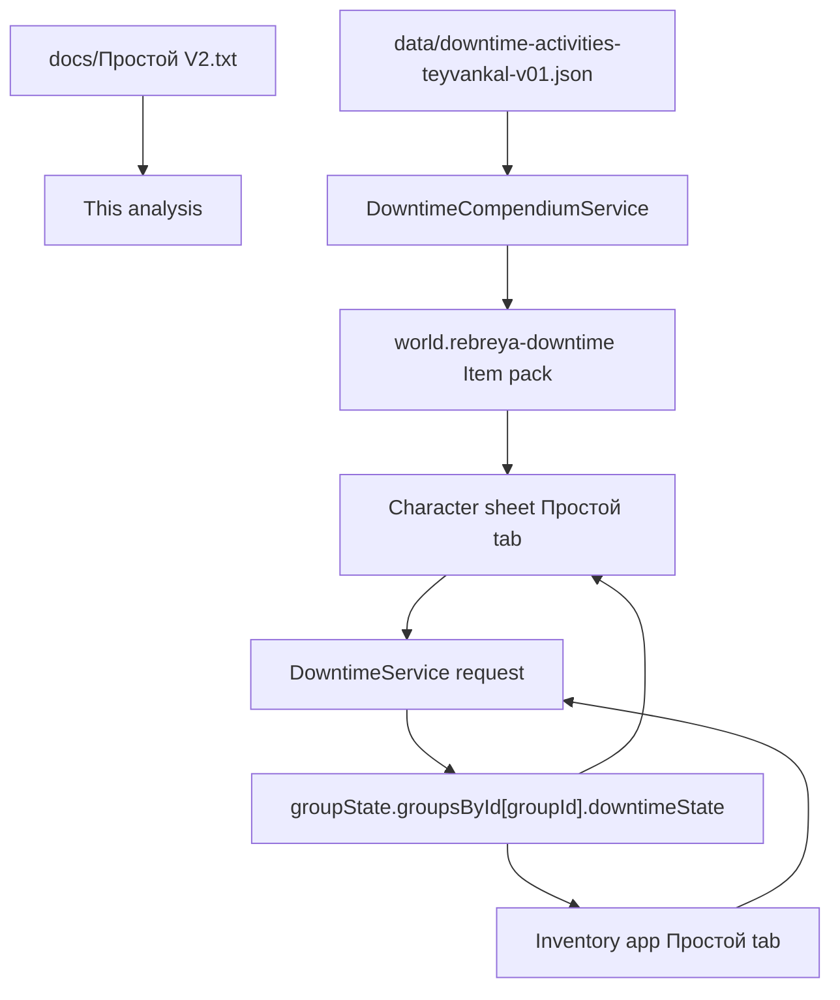

# Downtime V2 analysis notes

Date: 2026-06-07
Branch: lich_branch

## Scope

- Source rules: `docs/Простой V2.txt`.
- Current downtime data: `data/downtime-activities-teyvankal-v01.json`.
- Current runtime/UI:
  - `scripts/data/downtime-compendium.js`
  - `scripts/data/downtime-service.js`
  - `scripts/data/character-downtime-service.js`
  - `templates/character-downtime-tab.hbs`
  - `templates/inventory-app.hbs`
  - `scripts/integrations/dnd5e-sheet-extensions.js`
- Test coverage:
  - `tests/downtime-compendium.test.mjs`
  - `tests/downtime-service.test.mjs`
  - `tests/character-downtime-service.test.mjs`
  - `tests/dnd5e-sheet-downtime-tab.test.mjs`

## Current architecture snapshot

- The module defines a custom dnd5e Item type `rebreya-main.downtime` in `module.json`.
- `DowntimeCompendiumService` reads `data/downtime-activities-teyvankal-v01.json`, normalizes every activity, and creates managed Item documents in the world compendium `rebreya-downtime`.
- Each compendium item stores the structured downtime rules under `flags.rebreya-main.downtime`.
- `DowntimeService` manages group-level downtime balances and requests:
  - weeks are granted/revoked by GM;
  - player requests reserve weeks;
  - rejected/returned requests release reserved weeks;
  - completed requests move reserved weeks to spent weeks;
  - each request can hold up to 5 target actions/checks.
- Character sheet UI lets players select a downtime item, fill structured target inputs, submit a request, and roll supported check/choice target actions.
- Inventory app UI lets the GM inspect and manage group downtime requests.

## Current downtime items

The data file currently defines 26 downtime activities:

1. `craft` - Ремесло / Создание / Крафт
2. `firearm-crafting` - Создание огнестрельного оружия
3. `firearm-development` - Разработка огнестрельного оружия
4. `magic-item-crafting` - Создание магического предмета
5. `profession-work` - Работа по профессии
6. `rest` - Отдых
7. `research` - Исследование
8. `training` - Обучение
9. `gambling` - Азартные игры
10. `fighting-tournament` - Бойцовский турнир
11. `carousing` - Кутеж
12. `magic-item-purchase` - Покупка магического предмета
13. `crime` - Преступная деятельность
14. `spread-rumors` - Распространение слухов
15. `change-subclass` - Смена подкласса
16. `change-class` - Смена класса
17. `buy-magic-components` - Покупка магических компонентов
18. `search-magic-components` - Поиск магических компонентов
19. `gather-rumors` - Сбор слухов
20. `laboratory-alchemy` - Лабораторная алхимия
21. `scientific-lectures` - Участие в научных лекциях и семинарах
22. `invention-exhibition` - Участие в выставках изобретений
23. `charity` - Благотворительность
24. `racing` - Участие в гонках
25. `long-project` - Работа над длительным проектом
26. `construct-crafting` - Создание конструкта

## V2 source activity headings

`docs/Простой V2.txt` contains the same top-level set of headings found in the current data file. Some headings are complete rule blocks, while several are only headings/placeholders in the V2 text.

Complete or mostly complete V2 blocks:

- Ремесло / Создание / Крафт
- Создание огнестрельного оружия
- Разработка огнестрельного оружия
- Создание магического предмета (reference to chapter 8 only)
- Работа по профессии
- Отдых
- Исследование
- Обучение
- Азартные игры
- Бойцовский турнир
- Кутеж
- Покупка магического предмета (reference to chapter 8 only)
- Смена подкласса
- Лабораторная алхимия
- Работа над длительным проектом
- Создание конструкта

V2 headings without local mechanics in this file:

- Преступная деятельность
- Распространение слухов
- Смена класса
- Покупка магических компонентов
- Поиск магических компонентов
- Сбор слухов
- Участие в научных лекциях и семинарах
- Участие в выставках изобретений
- Благотворительность
- Участие в гонках

## Preliminary fit assessment

- Coverage by heading is complete: every V2 heading has a corresponding current data activity.
- The system is a request/workflow tracker plus structured template catalog, not a full rules engine.
- The JSON intentionally marks many rules as `partial`, `needs-work`, or `blocked`; that matches the current implementation shape.
- Highest-risk mismatch class: numeric/economic rules are usually stored as text/formulas for GM handling instead of being calculated and enforced.
- Highest-risk runtime gap: several target action types collect selections, but only `check`/`choice` actions are directly rollable; `resources`, `formulaRoll`, `downtimeResult`, and most outcome tables remain GM/manual.

## Runtime data flow

## Generated item ids

These ids are generated from `data/downtime-activities-teyvankal-v01.json` by `createStableDowntimeDocumentId(activity.id)`.

| Item _id | Downtime id | Name | Actions | Status |
|---|---|---:|---:|---|
| `1wuiah2v4fo12000` | `craft` | Ремесло / Создание / Крафт | 4 | `partial` |
| `12nu7e7dvsmga000` | `firearm-crafting` | Создание огнестрельного оружия | 5 | `partial` |
| `1kbqwoq7wrtfh000` | `firearm-development` | Разработка огнестрельного оружия | 4 | `partial` |
| `10eh7y19s68y3000` | `magic-item-crafting` | Создание магического предмета | 1 | `needs-work` |
| `c0ri64playon0000` | `profession-work` | Работа по профессии | 3 | `partial` |
| `2m6o7e16vdpuz000` | `rest` | Отдых | 2 | `partial` |
| `99a88x12p5cjr000` | `research` | Исследование | 5 | `partial` |
| `1u67jh6tigslc000` | `training` | Обучение | 3 | `needs-work` |
| `1qysn87q2t10b000` | `gambling` | Азартные игры | 5 | `partial` |
| `xvqxtq1dlzr9d000` | `fighting-tournament` | Бойцовский турнир | 5 | `partial` |
| `1vl7q6x14r662a00` | `carousing` | Кутеж | 2 | `partial` |
| `1t61a8b1qol6h900` | `magic-item-purchase` | Покупка магического предмета | 5 | `needs-work` |
| `107344yfrcz8c000` | `crime` | Преступная деятельность | 1 | `blocked` |
| `5opnlk15dady4000` | `spread-rumors` | Распространение слухов | 1 | `blocked` |
| `s2well1ekmdbu000` | `change-subclass` | Смена подкласса | 2 | `needs-work` |
| `1288v851eslqvy00` | `change-class` | Смена класса | 1 | `blocked` |
| `1rh03el1giq9vy00` | `buy-magic-components` | Покупка магических компонентов | 1 | `blocked` |
| `1r8z7td19ax9in00` | `search-magic-components` | Поиск магических компонентов | 1 | `blocked` |
| `m8yxag10xyod4000` | `gather-rumors` | Сбор слухов | 1 | `blocked` |
| `7q4pxzxt69280000` | `laboratory-alchemy` | Лабораторная алхимия | 2 | `needs-work` |
| `1975e7j1guew2g00` | `scientific-lectures` | Участие в научных лекциях и семинарах | 1 | `blocked` |
| `vwbo201qjrxo4000` | `invention-exhibition` | Участие в выставках изобретений | 1 | `blocked` |
| `3ykwqc1j585tv000` | `charity` | Благотворительность | 1 | `blocked` |
| `10fqh62hyixsw000` | `racing` | Участие в гонках | 1 | `blocked` |
| `184vuwu1tehn7a00` | `long-project` | Работа над длительным проектом | 3 | `partial` |
| `1e0sov6xsepe5000` | `construct-crafting` | Создание конструкта | 2 | `needs-work` |

## Per-activity comparison with V2

| Activity | Fit to V2 | Current implementation | Gaps / risks |
|---|---|---|---|
| `craft` | High structural fit, partial automation. | Item choice, resource note, day input, progress result. V2 values `5 зм/день` and half-price materials are present as formulas/text. | No automatic price/material/weight calculation, no workshop/tool rank validation, no explicit emergency-work hour table input, no worker upkeep handling, no direct link to `CraftingService` progress. |
| `firearm-crafting` | High structural fit, partial automation. | Firearm item choice, blueprint item choice, resources, day input, progress result. V2 `25 зм/день` is present. | Blueprint/material/workshop requirements are recorded but not enforced. `mustOwn` is data only unless the picker/runtime validates it elsewhere. No automatic weapon creation or cost/progress settlement. |
| `firearm-development` | Good fit for the explicit V2 fields. | Item choice, 200 gp weekly expense formula, Int/Str Tinker choice, project-progress result. | V2 says progress follows long-project rules but does not define thresholds; current implementation leaves that to GM. Start cost `2x weapon price` is textual, not computed from selected item price. Requirement "directly crafting firearms" is not enforced. |
| `magic-item-crafting` | Correctly minimal for V2. | Freeform placeholder, `needs-work`. | V2 only points to chapter 8. Need chapter 8 import before real validation. |
| `profession-work` | Partial. | Work modifiers are structured; result thresholds 10/20/30/40 are represented. `defaultWeeks: 4` approximates the "month" period. | Salary table by level is not represented as structured data, so pay is not calculated. Skill selection/check is freeform. "Troubles" on result below 10 are not modeled. Partial-month handling is unresolved. |
| `rest` | Partial. | One-week rest, lifestyle/resource requirement, result effect placeholder. | No automatic advantage against long diseases/poisons. No UI to choose effect/stat to restore. No effect removal/application. |
| `research` | Strong data fit, partial runtime. | Rank cost table matches V2. Extra steps input is capped at 5. Int check and result thresholds are represented. | Extra-step bonus is stored as data but not obviously applied to the character roll total. V2 penalties (`-5` per 10 CR, `-10` undocumented object) are absent. Resource cost is not debited. Facts learned remain GM text. |
| `training` | Data table mostly present, automation low. | Rank table has all seven training types with weeks/costs/learning points; option choice exposes the training type. | Options use `rank` for the point-like value instead of an explicit `learningPoints`. No calculation of learning point pool, no Int-modifier duration reduction, no teacher validation, no replacement of previous proficiencies, no automatic proficiency grant. |
| `gambling` | Good check structure, incomplete settlement. | Stake input; three checks; DC formula switches from `5+2d10` to `7+3d10`; thresholds for 0-3 successes. | Stake exactly 100 gp is ambiguous in V2; current `min: 100` treats it as high-risk. Gaming-set substitution is not modeled. Payout/debt is not automatically calculated or debited/credited. |
| `fighting-tournament` | Partial. | Standard/large-city option; Athletics, Acrobatics, and Constitution checks; DC formulas and reward thresholds. | Constitution check misses the special hit-die-roll bonus. No option to replace one skill check with a weapon attack. No urbanization/monthly availability enforcement. Prize is not automatically paid. |
| `carousing` | Partial, blocked by V2 missing result table. | Social-class resource choices with 10/50/250 gp and Persuasion check. | V2 references a "Кутеж" result table that is not in the file; current freeform result is appropriate. Nobility access/disguise requirement is not enforced. |
| `magic-item-purchase` | Cannot be fully verified from V2. | More structured than V2: item choice, trade-step option, 100 gp search cost, rarity price formulas. | V2 only points to chapter 8, so these formulas must be verified against that chapter, not this file. No trader/inventory/currency settlement in the downtime workflow. |
| `crime` | Correct placeholder. | Blocked freeform item. | V2 has heading only. |
| `spread-rumors` | Correct placeholder. | Blocked freeform item. | V2 has heading only. |
| `change-subclass` | Partial. | Resource action has `100 зм * БМ недель`; result is GM/freeform. | `defaultWeeks` is 1 rather than derived from proficiency bonus. No class/subclass picker and no safe class feature migration. |
| `change-class` | Correct placeholder. | Blocked freeform item. | V2 has heading only. |
| `buy-magic-components` | Correct placeholder. | Blocked freeform item. | V2 has heading only. |
| `search-magic-components` | Correct placeholder. | Blocked freeform item. | V2 has heading only. |
| `gather-rumors` | Correct placeholder. | Blocked freeform item. | V2 has heading only. |
| `laboratory-alchemy` | Table values match, UI incomplete. | Rank table stores potion levels 1-9 with weeks and costs. | No option/numeric control to choose potion level from the table. No workshop validation, no potion item creation, no alchemy-rule integration. |
| `scientific-lectures` | Correct placeholder. | Blocked freeform item. | V2 has heading only. |
| `invention-exhibition` | Correct placeholder. | Blocked freeform item. | V2 has heading only. |
| `charity` | Correct placeholder. | Blocked freeform item. | V2 has heading only. |
| `racing` | Correct placeholder. | Blocked freeform item. | V2 has heading only. |
| `long-project` | Partial but V2 itself delegates details. | Resource note, freeform project check, progress thresholds. | The thresholds appear to encode assumed long-project rules not present in V2 text. Project rank/resource schema and exact progress target are GM/manual. |
| `construct-crafting` | Partial. | Resource note and progress result. | No construct choice, no construct cost table, no workshop rank validation, no modifier calculation, no final construct creation. |

## Cross-cutting findings

- Source metadata mismatch: `data/downtime-activities-teyvankal-v01.json` and `DowntimeCompendiumService` still label the source as "БЕТА Заметки о землях Тейванкаля, 2-я редакция (1)" / "ЗоЗТ: Между приключениями", not `Простой V2.txt`.
- Rank/urbanization is stored as text (`rank`) but not checked against a city or location.
- General V2 timing says working weeks are 5 days and a day needs 8 hours; runtime accounting reserves whole weeks. Day-level details exist only inside some target actions like craft days.
- Currency/material costs are mostly descriptive. The downtime workflow does not debit actor/group currency, consume materials, create output items, or pay rewards.
- `checks` is the runtime field for all target actions, not only skill checks. This is documented as compatibility, but it can confuse future migrations.
- `check` actions can be rolled from the character sheet. `choice` actions can represent alternatives, but immediate auto-roll skips checks with multiple choices. `resources`, `itemChoice`, `numericInput`, `optionChoice`, `formulaRoll`, and `downtimeResult` are stored/displayed, not fully executed.
- `scripts/main.js` and generated entry `scripts/main-1.4.36.js` duplicate logic; `module.json` currently loads `scripts/main-1.4.36.js`. Any future code fix must keep that release file in sync or update the manifest workflow.

## Suggested priority

1. Update source metadata to explicitly mention `Простой V2.txt` if this file is now the canonical source.
2. Add focused data/test coverage for the biggest rule omissions that are already in V2:
   - research penalties and extra-step bonus application;
   - profession-work salary table;
   - training learning point pool and Int-modifier duration reduction;
   - fighting-tournament hit-die bonus and attack substitution;
   - craft emergency-work hour table.
3. Add resource settlement only after deciding whether downtime should spend actor currency, group currency, or just produce GM-facing cost summaries.
4. Keep placeholder activities as blocked until their missing V2 sections or external chapters are imported.
