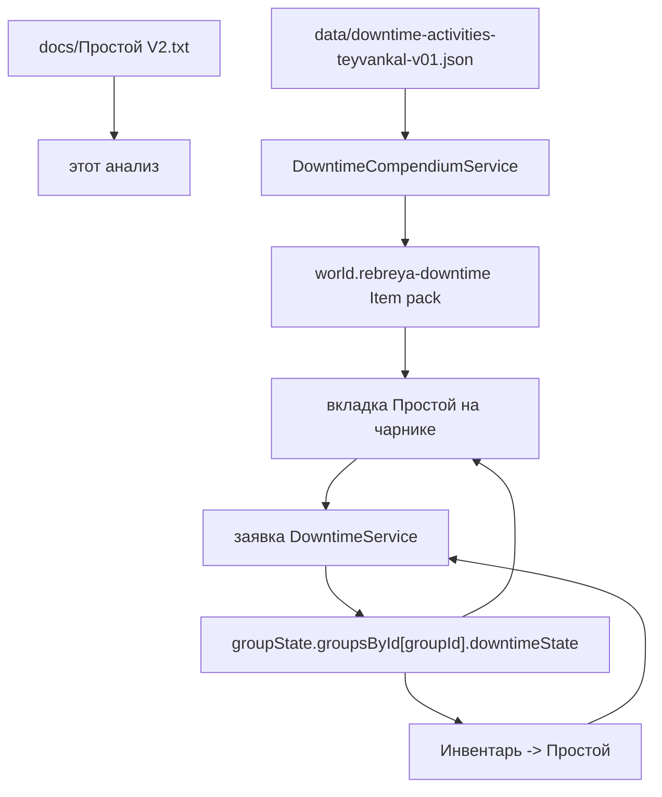

# Анализ соответствия простоя V2

Дата: 2026-06-07
Ветка: `lich_branch`

## Заметка 2026-06-08: рендер описания в чарнике

- Предметы простоя уже хранят полный HTML V2 в `system.description.value` и `flags.rebreya-main.downtime.descriptionHtml`.
- Отдельный runtime-разрыв был во вкладке персонажа: выбранный простой рендерился через старые поля `summary`, `requirements` и `targetActions`, поэтому в чарнике было видно сокращенное описание вместо полного текста предмета.
- Исправляемый контракт: `descriptionHtml` должен идти прямым полем через каталог/выбор из браузера в `CharacterDowntimeService`, а шаблон чарника должен рендерить этот HTML как цельный блок без повторного парсинга или пересборки из частей.
- Структурные поля заявки остаются отдельными контролами под описанием: они нужны для отправки и автоматизации, но больше не являются заменой текста простоя.

## Заметка 2026-06-08: таблицы в описаниях

- В прямых HTML-описаниях V2 табличные блоки нельзя хранить как последовательность строк через ` `: Foundry показывает их как развалившийся список значений.
- Восстановлены HTML-таблицы для `craft`, `profession-work`, `research`, `gambling`, `fighting-tournament` и `laboratory-alchemy`.
- Тестовый контракт теперь требует 8 таблиц с `<caption>` и запрещает старые `Название таблицы Колонки...` последовательности.

## Заметка 2026-06-08: чарник, ручные броски и высота описания

- Полное описание выбранного простоя во вкладке персонажа больше не ограничивается внутренним `max-height`: скролл должен оставаться у листа/окна, а не у маленького блока описания.
- Отправка заявки больше не бросает одиночные проверки автоматически. Все поддерживаемые проверки появляются в отправленной заявке как d20-кнопки, чтобы игрок сам выбрал бафы и момент броска.
- Для целевых действий с выбором после одного броска сохраняется `choiceIndex`: выбранный вариант показывает результат, остальные варианты остаются видимыми, но неактивными.

## Область анализа

- Источник правил: `docs/Простой V2.txt`.
- Текущий каталог простоя: `data/downtime-activities-teyvankal-v01.json`.
- Текущая логика и UI:
  - `scripts/data/downtime-compendium.js`
  - `scripts/data/downtime-service.js`
  - `scripts/data/character-downtime-service.js`
  - `templates/character-downtime-tab.hbs`
  - `templates/inventory-app.hbs`
  - `scripts/integrations/dnd5e-sheet-extensions.js`
- Тесты, которые покрывают простой:
  - `tests/downtime-compendium.test.mjs`
  - `tests/downtime-service.test.mjs`
  - `tests/character-downtime-service.test.mjs`
  - `tests/dnd5e-sheet-downtime-tab.test.mjs`

## Текущая архитектура

- Модуль объявляет отдельный dnd5e-тип предмета `rebreya-main.downtime` в `module.json`.
- `DowntimeCompendiumService` читает `data/downtime-activities-teyvankal-v01.json`, нормализует каждую активность и создает управляемые Item-документы в world compendium `rebreya-downtime`.
- Каждый предмет простоя хранит структурные правила в `flags.rebreya-main.downtime`.
- `DowntimeService` управляет групповыми балансами недель и заявками:
  - мастер выдает и отзывает недели;
  - заявка игрока резервирует недели;
  - отклоненная или возвращенная заявка освобождает недели;
  - завершенная заявка переносит недели из резерва в потраченные;
  - в каждой заявке может быть до 5 целевых действий/проверок.
- Вкладка персонажа позволяет выбрать предмет простоя, заполнить структурные поля, отправить заявку и бросить поддерживаемые проверки.
- Вкладка `Инвентарь -> Простой` дает мастеру очередь заявок, инспектор, выдачу недель и управление статусами.

## Текущие предметы простоя

В `data/downtime-activities-teyvankal-v01.json` сейчас 26 активностей:

1. `craft` - Ремесло / Создание / Крафт
2. `firearm-crafting` - Создание огнестрельного оружия
3. `firearm-development` - Разработка огнестрельного оружия
4. `magic-item-crafting` - Создание магического предмета
5. `profession-work` - Работа по профессии
6. `rest` - Отдых
7. `research` - Исследование
8. `training` - Обучение
9. `gambling` - Азартные игры
10. `fighting-tournament` - Бойцовский турнир
11. `carousing` - Кутеж
12. `magic-item-purchase` - Покупка магического предмета
13. `crime` - Преступная деятельность
14. `spread-rumors` - Распространение слухов
15. `change-subclass` - Смена подкласса
16. `change-class` - Смена класса
17. `buy-magic-components` - Покупка магических компонентов
18. `search-magic-components` - Поиск магических компонентов
19. `gather-rumors` - Сбор слухов
20. `laboratory-alchemy` - Лабораторная алхимия
21. `scientific-lectures` - Участие в научных лекциях и семинарах
22. `invention-exhibition` - Участие в выставках изобретений
23. `charity` - Благотворительность
24. `racing` - Участие в гонках
25. `long-project` - Работа над длительным проектом
26. `construct-crafting` - Создание конструкта

## Разделы в `Простой V2.txt`

`docs/Простой V2.txt` содержит тот же верхнеуровневый набор заголовков, что и текущий JSON-каталог. Часть разделов раскрыта правилами, часть является только заголовками или отсылками к внешним правилам.

Полностью или в основном описанные блоки V2:

- Ремесло / Создание / Крафт
- Создание огнестрельного оружия
- Разработка огнестрельного оружия
- Создание магического предмета, но только как отсылка к главе 8
- Работа по профессии
- Отдых
- Исследование
- Обучение
- Азартные игры
- Бойцовский турнир
- Кутеж
- Покупка магического предмета, но только как отсылка к главе 8
- Смена подкласса
- Лабораторная алхимия
- Работа над длительным проектом
- Создание конструкта

Заголовки V2 без локальной механики в этом файле:

- Преступная деятельность
- Распространение слухов
- Смена класса
- Покупка магических компонентов
- Поиск магических компонентов
- Сбор слухов
- Участие в научных лекциях и семинарах
- Участие в выставках изобретений
- Благотворительность
- Участие в гонках

## Краткая оценка соответствия

- Покрытие по заголовкам полное: каждый заголовок V2 имеет соответствующую активность в текущем JSON.
- Текущая система - это каталог шаблонов и workflow заявок, а не полный движок правил простоя.
- В JSON уже честно проставлены статусы `partial`, `needs-work` и `blocked`; они в целом соответствуют реальному состоянию автоматизации.
- Главный класс расхождений: числовые и экономические правила чаще сохранены как текст/формулы для мастера, но не считаются и не применяются автоматически.
- Главный runtime-разрыв: часть типов целевых действий собирает выборы игрока, но напрямую бросаются только `check`/`choice`. `resources`, `formulaRoll`, `downtimeResult` и большинство таблиц результата остаются ручными.

## Поток данных

## Стабильные id генерируемых предметов

Эти id генерируются из `data/downtime-activities-teyvankal-v01.json` через `createStableDowntimeDocumentId(activity.id)`.

| Item _id | Downtime id | Название | Действий | Статус |
|---|---|---:|---:|---|
| `1wuiah2v4fo12000` | `craft` | Ремесло / Создание / Крафт | 4 | `partial` |
| `12nu7e7dvsmga000` | `firearm-crafting` | Создание огнестрельного оружия | 5 | `partial` |
| `1kbqwoq7wrtfh000` | `firearm-development` | Разработка огнестрельного оружия | 4 | `partial` |
| `10eh7y19s68y3000` | `magic-item-crafting` | Создание магического предмета | 1 | `needs-work` |
| `c0ri64playon0000` | `profession-work` | Работа по профессии | 3 | `partial` |
| `2m6o7e16vdpuz000` | `rest` | Отдых | 2 | `partial` |
| `99a88x12p5cjr000` | `research` | Исследование | 5 | `partial` |
| `1u67jh6tigslc000` | `training` | Обучение | 3 | `needs-work` |
| `1qysn87q2t10b000` | `gambling` | Азартные игры | 5 | `partial` |
| `xvqxtq1dlzr9d000` | `fighting-tournament` | Бойцовский турнир | 5 | `partial` |
| `1vl7q6x14r662a00` | `carousing` | Кутеж | 2 | `partial` |
| `1t61a8b1qol6h900` | `magic-item-purchase` | Покупка магического предмета | 5 | `needs-work` |
| `107344yfrcz8c000` | `crime` | Преступная деятельность | 1 | `blocked` |
| `5opnlk15dady4000` | `spread-rumors` | Распространение слухов | 1 | `blocked` |
| `s2well1ekmdbu000` | `change-subclass` | Смена подкласса | 2 | `needs-work` |
| `1288v851eslqvy00` | `change-class` | Смена класса | 1 | `blocked` |
| `1rh03el1giq9vy00` | `buy-magic-components` | Покупка магических компонентов | 1 | `blocked` |
| `1r8z7td19ax9in00` | `search-magic-components` | Поиск магических компонентов | 1 | `blocked` |
| `m8yxag10xyod4000` | `gather-rumors` | Сбор слухов | 1 | `blocked` |
| `7q4pxzxt69280000` | `laboratory-alchemy` | Лабораторная алхимия | 2 | `needs-work` |
| `1975e7j1guew2g00` | `scientific-lectures` | Участие в научных лекциях и семинарах | 1 | `blocked` |
| `vwbo201qjrxo4000` | `invention-exhibition` | Участие в выставках изобретений | 1 | `blocked` |
| `3ykwqc1j585tv000` | `charity` | Благотворительность | 1 | `blocked` |
| `10fqh62hyixsw000` | `racing` | Участие в гонках | 1 | `blocked` |
| `184vuwu1tehn7a00` | `long-project` | Работа над длительным проектом | 3 | `partial` |
| `1e0sov6xsepe5000` | `construct-crafting` | Создание конструкта | 2 | `needs-work` |

## Сверка активностей с V2

| Активность | Соответствие V2 | Что есть сейчас | Пробелы и риски |
|---|---|---|---|
| `craft` | Хорошее структурное соответствие, частичная автоматизация. | Выбор предмета, заметка о ресурсах, ввод рабочих дней, итог прогресса. Значения V2 `5 зм/день` и материалы за половину цены есть как формулы/текст. | Нет автоматического расчета цены, материалов и веса. Не проверяется ранг мастерской/инструментов. Нет отдельного ввода таблицы экстренной работы. Не учтено содержание рабочих. Нет прямой связки с прогрессом `CraftingService`. |
| `firearm-crafting` | Хорошее структурное соответствие, частичная автоматизация. | Выбор оружия, выбор чертежа, ресурсы, рабочие дни, итог прогресса. Значение V2 `25 зм/день` есть. | Чертеж, материалы и мастерская записаны как требования, но не проверяются. `mustOwn` пока выглядит как данные, а не гарантированная проверка владения. Нет автоматического создания оружия и закрытия стоимости/прогресса. |
| `firearm-development` | Хорошо покрывает явные поля V2. | Выбор оружия, формула недельных расходов `200 зм`, выбор Инт/Сил с инструментами Жестянщика, итог прогресса проекта. | V2 говорит продвигать проект "как обычно", но не задает пороги; текущая реализация оставляет это мастеру. Стартовая стоимость `2x цена оружия` текстовая, не считается от выбранного предмета. Требование напрямую заниматься созданием огнестрела не проверяется. |
| `magic-item-crafting` | Минимально и корректно для V2. | Свободная заявка, статус `needs-work`. | В V2 только отсылка к главе 8. Для реальной автоматизации нужно импортировать правила главы 8. |
| `profession-work` | Частично. | Модификаторы работы структурированы; пороги 10/20/30/40 представлены. `defaultWeeks: 4` приближает период "месяц". | Таблица зарплаты по уровню не занесена как структура, поэтому оплата не считается. Выбор навыка и проверка свободные. "Трудности" при результате ниже 10 не моделируются. Не решено, как считать неполный месяц. |
| `rest` | Частично. | Одна неделя отдыха, требование к образу жизни/ресурсам, placeholder итогового эффекта. | Нет автоматического преимущества против длительных болезней/ядов. Нет UI для выбора эффекта или характеристики на восстановление. Нет применения/снятия эффекта. |
| `research` | Сильное соответствие по данным, частичная runtime-реализация. | Таблица стоимости по рангам совпадает с V2. Дополнительные шаги ограничены 5. Есть проверка Интеллекта и пороги результата. | Бонус за дополнительные шаги хранится как данные, но не очевидно применяется к броску персонажа. Нет штрафов V2 (`-5` за каждые 10 ПО, `-10` за незадокументированный объект). Деньги не списываются. Факты исследования остаются текстом мастера. |
| `training` | Таблица в основном есть, автоматизация низкая. | В `rankTable` есть 7 типов обучения с неделями, ценой и очками; `optionChoice` дает выбрать тип обучения. | В options используется поле `rank` для значения, похожего на очки обучения, вместо явного `learningPoints`. Нет расчета пула очков обучения, уменьшения срока на модификатор Интеллекта, проверки учителя, замены старого владения и автоматической выдачи владения. |
| `gambling` | Хорошая структура проверок, неполное закрытие экономики. | Ввод ставки; три проверки; формула СЛ переключается с `5+2d10` на `7+3d10`; есть пороги для 0-3 успехов. | Ставка ровно 100 зм неоднозначна в V2; текущий `min: 100` относит ее к высокой сложности. Нет замены навыка игровым набором. Выигрыш, потеря и долг не считаются и не списываются автоматически. |
| `fighting-tournament` | Частично. | Выбор обычного/крупного города; Атлетика, Акробатика и Телосложение; формулы СЛ и пороги награды. | Проверка Телосложения не добавляет бросок наибольшей Кости Хитов. Нет замены одной проверки броском атаки оружием. Не проверяются урбанизация и месячная доступность турнира. Награда не выплачивается автоматически. |
| `carousing` | Частично, дальше упирается в отсутствующую таблицу V2. | Выбор социального круга с ценой 10/50/250 зм и проверка Убеждения. | V2 ссылается на таблицу "Кутеж", но в файле ее нет; свободный итог тут оправдан. Доступ к знати/маскировка не проверяются. |
| `magic-item-purchase` | Нельзя полностью проверить по V2. | Структурировано сильнее, чем V2: выбор предмета, шаг торгов, стоимость поиска 100 зм, формулы цены по редкости. | V2 только ссылается на главу 8, поэтому эти формулы надо сверять с главой 8, а не с этим файлом. Нет связки с торговцами, наличием товара и расчетом валюты. |
| `crime` | Корректный placeholder. | Заблокированный свободный предмет. | В V2 только заголовок. |
| `spread-rumors` | Корректный placeholder. | Заблокированный свободный предмет. | В V2 только заголовок. |
| `change-subclass` | Частично. | Ресурсное действие хранит `100 зм * БМ недель`; итог свободный для мастера. | `defaultWeeks` равен 1, а не выводится из бонуса мастерства. Нет выбора класса/подкласса и безопасной миграции классовых фич. |
| `change-class` | Корректный placeholder. | Заблокированный свободный предмет. | В V2 только заголовок. |
| `buy-magic-components` | Корректный placeholder. | Заблокированный свободный предмет. | В V2 только заголовок. |
| `search-magic-components` | Корректный placeholder. | Заблокированный свободный предмет. | В V2 только заголовок. |
| `gather-rumors` | Корректный placeholder. | Заблокированный свободный предмет. | В V2 только заголовок. |
| `laboratory-alchemy` | Табличные значения совпадают, UI неполный. | В `rankTable` занесены уровни зелий 1-9 с неделями и стоимостью. | Нет выбора уровня зелья через option/numeric input. Нет проверки мастерской, создания зелья и интеграции с правилами алхимии. |
| `scientific-lectures` | Корректный placeholder. | Заблокированный свободный предмет. | В V2 только заголовок. |
| `invention-exhibition` | Корректный placeholder. | Заблокированный свободный предмет. | В V2 только заголовок. |
| `charity` | Корректный placeholder. | Заблокированный свободный предмет. | В V2 только заголовок. |
| `racing` | Корректный placeholder. | Заблокированный свободный предмет. | В V2 только заголовок. |
| `long-project` | Частично, но сам V2 делегирует детали внешним правилам. | Заметка о ресурсах, свободная проверка проекта, пороги прогресса. | Пороги выглядят как предположение из правил длительных проектов, которых нет в V2-тексте. Ранг, ресурсы и точная цель прогресса остаются ручными. |
| `construct-crafting` | Частично. | Заметка о ресурсах и итог прогресса. | Нет выбора конструкта, таблицы стоимости, проверки ранга мастерской, расчета модификаторов и создания готового конструкта. |

## Общие выводы

- Метаданные источника расходятся с новым документом: `data/downtime-activities-teyvankal-v01.json` и `DowntimeCompendiumService` все еще ссылаются на "БЕТА Заметки о землях Тейванкаля, 2-я редакция (1)" / "ЗоЗТ: Между приключениями", а не на `Простой V2.txt`.
- Ранг/урбанизация хранится как текстовое поле `rank`, но не проверяется против города или локации.
- Общие правила V2 говорят, что рабочая неделя - 5 дней, а день засчитывается при 8 часах работы. Runtime-состояние резервирует целые недели; дневные детали есть только в отдельных целевых действиях вроде рабочих дней крафта.
- Денежные и материальные расходы в основном описательные. Workflow простоя не списывает валюту актера/группы, не расходует материалы, не создает итоговые предметы и не выплачивает награды.
- Поле `checks` в runtime хранит все целевые действия, а не только проверки. Это описано как совместимость, но может путать будущие миграции.
- `check`-действия бросаются из чарника. `choice` может описывать альтернативы, но авто-бросок пропускает проверки с несколькими вариантами. `resources`, `itemChoice`, `numericInput`, `optionChoice`, `formulaRoll` и `downtimeResult` сохраняются и показываются, но не исполняются полностью.
- `scripts/main.js` и сгенерированный entry `scripts/main-1.4.36.js` дублируют логику; `module.json` сейчас грузит `scripts/main-1.4.36.js`. Любая будущая правка кода должна синхронизировать оба файла или менять release workflow.

## Приоритеты доработки

1. Обновить метаданные источника, если `Простой V2.txt` теперь канонический документ.
2. Добавить точечные данные и тесты для крупных пробелов, которые уже явно есть в V2:
   - штрафы исследования и применение бонуса за дополнительные шаги;
   - таблица зарплаты работы по профессии;
   - очки обучения и уменьшение срока на модификатор Интеллекта;
   - бонус Кости Хитов и замена атакой в бойцовском турнире;
   - таблица экстренной работы для крафта.
3. Добавлять автоматическое списание ресурсов только после решения, кто платит: актер, групповая казна или пока только мастерская сводка стоимости.
4. Оставить placeholder-активности в `blocked`, пока не появятся недостающие разделы V2 или внешние главы правил.

## 2026-06-09: Конструктор простоя

- Принято решение не делать костыль под `research`, а расширять общий конструктор целевых действий.
- Новые/уточненные типы конструктора: `rankChoice`, `optionChoice`, `numericInput`, `formulaRoll`, `resources`, `downtimeResult`.
- `resources` теперь должен уметь количество, лимит, `dependsOnRank`, будущий `dependsOnLevel`, `rankSourceActionId`, `rankCosts` и computed cost.
- `downtimeResult` должен быть не проверкой навыка, а итоговой формулой/условиями от результатов предыдущих целевых действий.
- `research` пересобирается так: `research-rank` = `rankChoice`; `research-resources` = ресурс "Шаг исследования" с max 5 и таблицей стоимости по рангу; `research-check` = единственная проверка Интеллекта; `research-result` = пороги от `research-check.total`.

## 2026-06-09: Передача порогов в итог простоя

- Уточнена модель `downtimeResult`: для исследования итог больше не хранит собственные numeric-пороги и не считает отдельную формулу от `total`.
- `research-check` теперь записывает порог проверки через `recordMode: "pass-thresholds"`: провал, частичный успех, успех, сильный успех.
- `research-result` теперь имеет `outcomeMode: "pass-thresholds"` и `recordMode: "single-result"`; он мапит `thresholdOutcome` из `research-check` в одно значение `fragments`.
- UI конструктора для `downtimeResult` показывает маппинг "порог -> значение/подпись" и не рендерит отдельную вкладку "Итог".
- В заявках не-бросковые целевые действия подписываются своим типом: выбор ранга, ресурсы, итог. Для игрока дополнительно показываются выбранный ранг, стоимость/количество и вычисленный итог.
