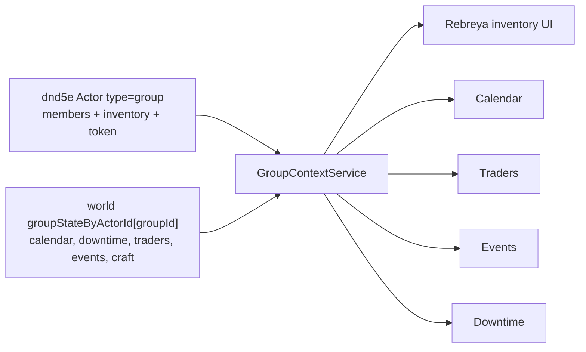

# Дизайн группового контекста Rebreya и простоя

Дата: 2026-06-01
Статус: утвержденный дизайн после обсуждения

## Цель

Перевести изменяемые подсистемы Rebreya с единого глобального состояния мира на состояние конкретной группы игроков. Группа должна быть штатным dnd5e `Actor` типа `group`, а Rebreya должна использовать его как центр контекста для состава, инвентаря, календаря, лавок, ивентов, крафта и простоя.

## Ключевые решения

- Источник группы: существующий штатный dnd5e `Actor` типа `group`.
- Источник состава: только `groupActor.system.members`; Rebreya не дублирует список участников.
- Источник группового склада: inventory и currency самого `Actor` типа `group`.
- Старый отдельный `Actor` склада Rebreya больше не является целевой моделью.
- Для ГМа активная группа хранится как world-level выбор Rebreya.
- Для игрока активная группа определяется автоматически по его персонажу в Rebreya-группе.
- Один Foundry-профиль игрока не должен состоять в двух группах. Если нужно два персонажа в разных группах, используются два профиля.
- Базовое состояние новой группы строится из файлов модуля и дефолтных расчетов, а не из текущего старого инвентаря.
- Старый склад мигрируется только в первую выбранную группу как совместимость со старой версией.

## Архитектура контекста

Вводится сервис `GroupContextService`, через который все группозависимые окна и сервисы получают текущий контекст.



`GroupContextService` должен уметь:

- получить активную группу ГМа из world setting;
- найти группу игрока по owned character в `groupActor.system.members`;
- вернуть `groupActor`, `groupId`, `groupState`, права пользователя и список участников;
- показать понятную ошибку, если группа не выбрана или игрок не состоит в группе;
- принимать явный `{ groupActorId }` для API и GM-операций.

## Окно "Группы"

В панели `Ребрея` добавляется GM-кнопка `Группы`.

Окно не создает группу-актор. Оно работает с существующими dnd5e group actors:

- показывает найденные `Actor` типа `group`;
- позволяет выбрать активную группу Rebreya для ГМа;
- регистрирует выбранный group actor флагом `flags.rebreya-main.managedPartyGroup = true`;
- показывает статус инициализации group-state;
- показывает кратко: состав, дату, состояние простоя, лавок и ивентов;
- открывает штатный лист группы;
- запускает миграцию старого склада в выбранную первую группу;
- показывает диагностику сломанного состояния, если group actor удален, а state остался.

Добавление и удаление участников остается штатным функционалом dnd5e group sheet. Rebreya читает участников, но не владеет этим списком.

## Состояние группы

Вводится world setting с registry по id группы, например `groupState`.

Структура одной записи:

```js
{
  version: 1,
  groupActorId: "abc123",
  initializedAt: 0,
  calendar: {},
  traderState: {},
  tradeAudit: [],
  globalEventsState: {},
  craftState: {},
  downtimeState: {},
  migration: {
    legacyInventoryMergedAt: 0,
    legacyInventoryActorId: ""
  }
}
```

Состояние, которое должно стать групповым:

- календарь;
- очередь крафта;
- runtime-состояние лавок и ассортимента;
- аудит торговли;
- активные ивенты и их даты;
- простой;
- любые будущие данные, зависящие от конкретной партии.

Базовая экономическая модель из `data/*.json` остается общей: города, товары, регионы, материалы, снаряжение и расчетные справочники мира.

## Базовое состояние мира

Baseline новой группы не берется из старого партийного инвентаря.

Базой считаются:

- файлы модуля `data/*.json`;
- дефолтная экономическая модель после загрузки данных;
- дефолтный trader runtime, рассчитанный для группы из модели;
- дефолтный календарь;
- пустой крафт;
- пустой простой;
- дефолтные шаблоны ивентов, если они импортируются из модуля.

При регистрации новой Rebreya-группы модуль создает `groupStateByActorId[groupId]` из этой базы. Inventory самой dnd5e-группы остается ее собственным inventory и не получает предметы старого склада, кроме специальной миграции первой группы.

## Миграция старой версии

Старое состояние совместимости переносится отдельно от baseline.

Для первой зарегистрированной группы:

- ГМ выбирает существующий dnd5e `Actor` типа `group`;
- Rebreya помечает его как `managedPartyGroup`;
- group-state создается из файловой базы;
- старый `Инвентарь группы Rebreya`, если найден, сливается в inventory выбранного group actor;
- монеты старого склада суммируются с монетами group actor;
- предметы с одинаковыми `flags.rebreya-main.sourceType + sourceId` суммируются по количеству;
- кастомные предметы с одинаковым именем и типом суммируются;
- старый склад не удаляется автоматически и помечается флагом миграции;
- повторная миграция не должна дублировать уже перенесенные предметы.

Старый состав Rebreya можно показать для сверки, но источником правды после регистрации является `groupActor.system.members`.

## Инвентарь и крафт

Rebreya inventory UI должен читать и изменять inventory текущего dnd5e group actor.

Сохраняются текущие возможности:

- предметы;
- монеты;
- еда и вода как управляемые supply-предметы;
- разбор предметов на материалы;
- добавление model item из справочников;
- drag-and-drop предметов;
- расчет веса и запасов.

Очередь крафта хранится в group-state, но материалы списываются из inventory текущего group actor, а готовые предметы добавляются туда же.

## Календарь, лавки и ивенты

Календарь хранится отдельно на группу. Все действия продвижения времени работают в текущем групповом контексте.

Лавки:

- базовая модель города и товаров общая;
- runtime-состояние торговцев групповое;
- остатки после покупок, месячные обновления и аудит торговли не пересекаются между группами.

Ивенты:

- шаблоны и описания могут оставаться мировыми;
- активации, даты, включение и выключение должны быть групповыми;
- одна и та же война, кризис или блокада может быть активна для одной группы и не активна для другой.

## Простой

Простой хранится в `groupStateByActorId[groupId].downtimeState`.

Основные данные:

```js
{
  balancesByActorId: {
    actorId: { availableWeeks: 0, reservedWeeks: 0, spentWeeks: 0 }
  },
  requests: [],
  checks: [],
  history: []
}
```

Поток:

1. ГМ выдает X недель простоя всем текущим участникам `groupActor.system.members` или выбранным участникам.
2. Игрок видит свои доступные недели в чарнике, в Rebreya-блоке или во вкладке куклы героя.
3. Игрок создает заявку из каталога действий или как уникальную заявку.
4. При отправке недели резервируются.
5. ГМ может одобрить, отклонить, вернуть на правки, изменить стоимость, назначить проверки или завершить вручную.
6. Игрок бросает назначенные проверки из чарника.
7. Результаты бросков записываются в заявку.
8. ГМ завершает заявку, списывает недели и описывает результат.

Каталог первого этапа должен покрыть действия из главы 9:

- Ремесло / создание / крафт;
- создание и разработка огнестрельного оружия;
- создание магического предмета как ссылка на главу 8;
- работа по профессии;
- отдых;
- исследование;
- обучение;
- азартные игры;
- бойцовский турнир;
- кутеж;
- покупка магического предмета как ссылка на главу 8;
- смена подкласса;
- лабораторная алхимия;
- работа над длительным проектом;
- создание конструкта;
- уникальная заявка.

На первом этапе не требуется полностью автоматизировать таблицы результатов. Важнее надежный workflow заявок, резервов, одобрений и назначенных проверок.

## Права

ГМ:

- выбирает активную группу;
- регистрирует Rebreya-группы;
- запускает миграцию старого склада в первую группу;
- управляет простоями и заявками;
- видит все группы и их состояние.

Игрок:

- автоматически попадает в свою Rebreya-группу;
- видит inventory, календарь и данные своей группы в пределах разрешенных прав;
- создает свои заявки простоя;
- бросает назначенные проверки;
- не может управлять чужими заявками и group-state напрямую.

Сокетные запросы игрок -> ГМ должны проходить проверку прав по участию персонажа в группе и ownership actor.

## Ошибки и крайние случаи

- Если ГМ не выбрал группу, групповые окна показывают экран выбора группы.
- Если игрок не состоит в Rebreya-группе, он видит понятное сообщение.
- Если игрок оказался в двух группах, модуль показывает ошибку настройки; такой сценарий не поддерживается.
- Если group actor удален, state сохраняется, а окно `Группы` помечает запись как сломанную.
- Если участник удален из группы, его downtime balances и история архивируются, но не удаляются сразу.
- Если миграция старого склада уже выполнена, повторный запуск не дублирует предметы.

## Тестирование

Нужны unit-тесты:

- резолв активной группы для ГМа;
- резолв группы игрока по owned character;
- ошибка при отсутствии группы;
- ошибка при двух группах у одного игрока;
- инициализация group-state из файловой базы;
- миграция старого склада в group actor без дублей;
- слияние предметов и монет;
- перенос inventory UI на group actor;
- изоляция trader runtime между группами;
- downtime: выдача недель, резерв, отклонение, одобрение, назначение проверок, завершение.

Нужна ручная проверка в Foundry:

- ГМ выбирает активную группу в панели `Ребрея`;
- игрок из другой группы открывает свою группу, а не активную GM-группу;
- покупка в лавке меняет остаток только для текущей группы;
- календарь двигается отдельно для разных групп;
- заявка простоя проходит путь игрок -> ГМ -> проверка -> результат.
