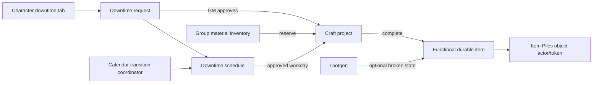

# Durability, Crafting, Downtime, and Item Piles Design

**Date:** 2026-07-16

**Status:** Approved direction; remaining implementation decisions resolved in this specification

## Goal

Unify four currently separate concerns into one group-scoped workflow:

- nonmagical equipment can have durability and can exist in a broken state;
- Lootgen can generate broken equipment without replacing its underlying item definition;
- a physical item placed through Item Piles can expose object HP, AC, and damage threshold;
- mundane crafting becomes a real downtime project whose work is scheduled on the group calendar and initiated from the character sheet.

The design must preserve existing Foundry item functionality, group isolation, calendar integration, and recoverable inventory mutations.

## Confirmed Product Rules

- Durability applies to nonmagical gear. Magic items are excluded from this subsystem.
- A broken item keeps its physical form but provides no functions or benefits.
- Repair is not implemented in this slice. The data model only leaves a stable extension point for it.
- Crafting and downtime are separate domains:
  - a craft project owns recipe, resources, progress, and output;
  - downtime owns character time, requests, approval, and calendar placement.
- Players submit crafting from the downtime tab on their character sheet.
- A GM grants downtime in weeks. One granted week equals five workday credits.
- Granted workdays appear on the calendar automatically from the nearest upcoming Monday. If that week is occupied for the character, scheduling continues from the next free week.
- Players do not select dates manually. Requests consume the earliest available workdays.
- A city workshop permits crafting on Monday through Friday.
- An owned workshop permits crafting on all seven days. It does not grant more workday credits; it compacts the same credits into fewer calendar weeks.
- "Owned workshop" is initially only a checkbox in the downtime crafting form. The player proposes it and the GM can change it during approval.
- Any forward manual calendar change processes approved downtime, including changes synchronized from SmallTime.
- Travel-driven time explicitly does not process downtime.
- Calendar date changes require confirmation.
- Right-clicking a calendar day opens a compact downtime summary.
- Every request is represented on the calendar with status color and counts, including pending requests.
- Materials are fully reserved when the GM approves a craft project.
- The `Энциклопедия материалов` sheet in `Ребрея: Оружие, огнестрел и снаряжение` is the source of truth for the Rebreya material catalog.
- Every named material row is imported, including tool-specific base raw materials and `Алхимические реагенты`.
- Base raw material is a real inventory material selected by the required tool, not an abstract currency charge.

## Non-Goals

- No repair action, repair UI, repair checks, or repair resource consumption.
- No magic-item crafting or magic-item durability.
- No property or workshop registry. Workshop ownership is a request/project boolean for now.
- No automated verification that an owned workshop physically exists in a city or property record.
- No redesign of unrelated downtime activities beyond the workday migration and shared calendar scheduling.
- No aggregate durability for a pile containing multiple unrelated items.

## Current-State Diagnosis

The current `CraftingService` does not implement the written crafting rules:

- it debits half of item weight rather than materials worth half of market value;
- it uses `5 + tool modifier + proficiency` as daily progress without a matching rule;
- it progresses every queued task simultaneously;
- it has no workshop rank, tool rank, work hours, emergency work, or per-character occupancy;
- it can progress from an independent button without a calendar or downtime day;
- it outputs the generic gear inventory representation rather than a dedicated durable item instance.

The downtime system already contains the correct integration foundation:

- a `craft` activity exists in the downtime compendium and is marked as partially automated;
- character sheets can select structured activity inputs and submit group-scoped requests;
- requests reserve time and pass through GM approval;
- long-running projects can remain visible on the character sheet;
- group state already owns downtime and calendar data.

The existing craft queue should therefore be replaced by projects linked to downtime requests, not expanded as a second scheduler.

## Selected Architecture



### `DowntimeService`

Owns:

- workday grants and balances;
- requests and GM decisions;
- reservation of character time;
- request-to-date scheduling;
- per-date work logs;
- calendar display rows.

It does not calculate craft progress or mutate craft resources.

### `CraftingService`

Owns:

- craft project definitions and lifecycle;
- recipe and requirement validation;
- predominant and base-raw material reservations;
- workday progress calculation;
- output creation and project cancellation.

It does not grant time or choose calendar dates.

### `CalendarTransitionCoordinator`

Owns all date transitions that may have daily side effects:

- direct date selection;
- set-date form submission;
- advance day/week/month actions;
- SmallTime forward synchronization;
- explicit shifts from other module workflows.

It enumerates crossed dates and asks `DowntimeService` to process each date. Callers such as travel pass `processDowntime: false`.

### `DurabilityService`

Owns:

- durability eligibility and material profile resolution;
- item durability initialization;
- broken and destroyed state transitions;
- functional suppression for broken items;
- Item Piles actor/token durability projection.

It does not repair items in this slice.

## Group State

Downtime and craft remain scoped to the active dnd5e group actor through the group registry.

### Downtime state v2

```js
{
  version: 2,
  balancesByActorId: {
    actorId: {
      availableWorkdays: 0,
      reservedWorkdays: 0,
      spentWorkdays: 0,
      totalGrantedWorkdays: 0
    }
  },
  grants: [{
    id,
    actorId,
    workdays,
    anchorMonday,
    createdAt,
    reason
  }],
  requests: [],
  scheduleSlots: [{
    id,
    actorId,
    isoDate,
    status: "free" | "pending" | "approved" | "processed" | "blocked",
    grantId,
    requestId,
    projectId,
    activityId,
    hours,
    blockReason,
    processedTransitionId
  }],
  workLog: [{
    id,
    actorId,
    isoDate,
    requestId,
    projectId,
    result,
    transitionId,
    createdAt
  }],
  history: [],
  counter: 0
}
```

### Craft state v2

```js
{
  version: 2,
  counter: 0,
  projects: [{
    id,
    groupId,
    requestId,
    crafterActorId,
    status: "active" | "blocked" | "paused" | "completed" | "cancelled",
    profile: "mundane" | "firearm" | "legacy",
    outputs: [{ sourceType, sourceId, name, quantity, unitPriceGold, unitWeightLb }],
    targetGold,
    progressGold,
    hoursPerDay,
    ownedWorkshop,
    requiredRank,
    requiredToolId,
    requiredToolRank,
    workshopApproval: { confirmedByUserId, confirmedAt },
    reservation: {
      predominantMaterialId,
      predominantMaterialLbReserved,
      predominantMaterialLbSpent,
      baseRawMaterialId,
      baseRawQuantityReserved,
      baseRawQuantitySpent,
      baseRawWeightLbReserved,
      baseRawWeightLbSpent,
      receipts: []
    },
    createdAt,
    updatedAt,
    completedAt
  }]
}
```

`outputs` is an array so one project can create several cheap items within the same daily investment limit.

## Downtime Scheduling

### Grants

- The GM continues to grant an integer number of weeks.
- The service converts each week to five workday credits.
- The first candidate week starts on the nearest upcoming Monday; if the current date is Monday, the current date is eligible.
- A grant is placed in whole Monday-Friday blocks.
- If a candidate week already contains allocated downtime for that actor, the grant skips to the next free Monday.
- Free grant slots appear on the calendar immediately with a neutral tint.

### Request allocation

- A submitted request reserves the earliest available workday credits for that actor.
- A request cannot reserve more workdays than are available.
- Players never choose start dates.
- Pending requests occupy and color their projected slots immediately.
- Returned, rejected, or cancelled requests release their future slots.
- Processed slots are immutable historical records.

### City versus owned workshop

- City workshop requests may occupy only Monday-Friday.
- Owned workshop requests may occupy all seven weekdays.
- The workday credit count does not change.
- When an owned-workshop request is created or edited, the scheduler may reflow only unprocessed future slots to compact the request across weekends.
- A GM change to the checkbox during approval triggers the same future-only reflow.
- Removing an owned-workshop request rebuilds remaining future free slots deterministically.

### Occupancy

- One actor may have at most one primary downtime activity on a calendar date.
- Different actors may work on different requests on the same date.
- One craft project has one primary crafter in this slice.
- Multi-crafter projects remain a future extension because they require explicit shared-progress rules.

## Calendar Integration

### Forward transitions

Every forward manual transition:

1. builds a preview of crossed dates and affected schedule slots;
2. asks for GM confirmation;
3. commits the calendar transition;
4. processes eligible approved slots in date order;
5. records each result with a stable transition ID;
6. refreshes calendar, downtime, craft, character sheets, and SmallTime display.

The transition journal and per-date work log make retries idempotent. Repeating a SmallTime synchronization or moving backward and forward cannot grant progress twice.

### Backward transitions

- Moving backward requires confirmation.
- It never reverses work, resources, completed items, or request statuses.
- Previously processed dates remain in `workLog` and cannot process again automatically.
- Corrections use an explicit GM adjustment with an audit entry.

### Failures

- Calendar time still passes if a scheduled workday is blocked.
- A blocked slot records a reason and does not spend materials or workday credit.
- The GM can resolve the cause and explicitly retry that slot or let the scheduler place the remaining work on a later date.
- A craft output or resource mutation failure is handled by the durable craft mutation journal and cannot silently duplicate value.

### SmallTime and travel

- Forward date changes received from SmallTime use `processDowntime: true`.
- Travel time uses `processDowntime: false`.
- Other callers must choose explicitly; the default for direct GM calendar controls is `true`.

## Calendar UI

The existing calendar grid remains structurally intact.

- A day with free granted downtime receives a neutral tint.
- Pending request count is amber.
- Approved request count is blue.
- Processed request count is green.
- Blocked request count is red.
- A mixed day uses the highest-severity tint (`blocked`, `pending`, `approved`, `processed`, `free`) and shows small colored numeric markers for every present status.
- The total request count appears in the day corner.
- Current date remains identifiable by its existing strong border.
- Outside-month opacity remains, but status markers retain readable contrast.

Left-click preserves date navigation but opens a confirmation dialog first. The dialog shows old date, new date, direction, number of crossed days, and affected downtime counts.

Right-click prevents the browser menu and opens the existing compact Rebreya context menu. It lists:

- actor name;
- request/activity name;
- status;
- hours;
- for craft: item batch and workshop mode;
- block reason when present.

The menu is informational for players. GM-only actions may open the request or project but do not edit schedule dates directly.

## Character-Sheet Crafting Flow

The downtime library keeps `craft` as the entry point.

The craft form contains:

- searchable item/batch selection from nonmagical `gear` data;
- quantity per output row;
- hours per workday, default `8`, range `8-16`;
- `Owned workshop` checkbox;
- computed required rank, tool, market value, material reservation, workdays, and projected dates.

The player submits one request. The request immediately reserves time and colors calendar slots as pending.

During approval the GM may:

- change the owned-workshop checkbox;
- confirm a suitable workshop of the required rank;
- adjust hours per day;
- return or reject the request.

Approval atomically:

1. revalidates the actor, tool, outputs, prices, both material stocks, and available slots;
2. reserves all resources;
3. creates the craft project;
4. links project and request;
5. changes scheduled slots to approved.

No craft progress occurs merely because the request was approved.

## Crafting Rules

### Eligibility

- Mundane crafting accepts only nonmagical gear.
- Magic-item sources and items with an explicit magical property are rejected.
- The required crafting rank is the maximum rank among batch outputs.
- The required tool comes from each gear entry's linked tool. A batch requiring incompatible tools must be split into separate projects.
- Tool proficiency and tool modifier do not increase daily progress.

### Tool rank

Party-member tool state gains a nonnegative `rank`.

Tool access resolution uses:

1. the highest-rank matching tool item owned by the actor when it has Rebreya source metadata;
2. the manually configured party-member tool state as fallback.

The effective tool rank must meet the project rank. Missing legacy rank normalizes to `0`.

### Workshop rank

There is no workshop registry in this slice. GM approval is the attestation that an appropriate workshop is available.

The project stores:

- required rank;
- owned/city mode;
- approving GM and timestamp.

This snapshot can later be replaced by a `workshopId` without changing project semantics.

### Progress

The standard emergency-work table is authoritative:

| Hours | Added hours | Base daily progress |
| ---: | ---: | ---: |
| 8 | 0 | 5 gp |
| 9 | 1 | 5.5 gp |
| 10 | 2 | 6 gp |
| 11 | 3 | 6.5 gp |
| 12 | 4 | 7 gp |
| 13 | 5 | 7.5 gp |
| 14 | 6 | 8 gp |
| 15 | 7 | 9 gp |
| 16 | 8 | 10 gp |

Effects alter the base investment through a dedicated resolver. They do not mutate stored recipes. The entire emergency table scales by `effectiveBase / 5`, preserving the relationship between standard and emergency work.

Firearm crafting uses profile multiplier `5`, resulting in `25 gp` for an eight-hour day before other explicit effects. It also requires a blueprint marker and tinker's tools. Magic-item crafting is excluded.

Daily progress is capped by remaining project target.

### Material reservation

The material catalog is synchronized from the Google Sheet tab `Энциклопедия материалов`:

- spreadsheet ID `1G-UCW00vsjON05fr0CgyK03YaF82oYJemlqNKdv1JBk`, observed Drive update `2026-07-14T16:02:48.626Z`;
- the sheet currently contains 247 named data rows (`3-249`);
- `data/materials.json` currently contains 45 of those rows;
- the import therefore adds the 202 missing rows and preserves the existing stable IDs where names already match;
- every imported row records source sheet and row metadata for later diffing;
- type, subtype, price, weight, rank, description, four application columns, knowledge use, and alchemical aspects are preserved;
- blank source cells remain `null`; no price, weight, or rank is invented;
- a row with missing or nonpositive price or weight remains visible in the encyclopedia but is unavailable for automatic craft reservation.

The tool-specific rows `Базовое сырье для Инструменты ...` are normal material records. The required craft tool resolves exactly one matching base-raw material by its `Создание и ремонт инструментов: ...` application. Missing or ambiguous mapping blocks approval and names the tool that needs source-data correction.

For total market price `P`:

```text
materialValue = P * 0.5
maximumPredominantWeight = total output weight
predominantWeight = min(maximumPredominantWeight, materialValue / materialPricePerLb)
predominantValue = predominantWeight * materialPricePerLb
baseRawValue = materialValue - predominantValue
baseRawQuantity = baseRawValue / baseRawUnitPrice
baseRawWeight = baseRawQuantity * baseRawUnitWeight
```

- Predominant material is reserved in pounds from group inventory.
- The remainder is reserved from the matching tool-specific base raw material already present in group inventory.
- Base-raw quantities may be fractional and use the inventory service's existing bounded decimal precision.
- A missing or nonpositive material price blocks approval rather than guessing a quantity.
- A missing or nonpositive base-raw unit price or unit weight also blocks approval.
- All reservation calculations are server-side on the active GM.
- Each processed workday moves a proportional amount from reserved to spent.
- Cancellation returns only the unspent predominant and base-raw materials.
- Completion consumes all remaining rounding residue.

### Output

Completion creates the best available functional item representation from the managed gear compendium/source document, then applies Rebreya source and durability flags.

Crafted items start:

- nonmagical;
- intact;
- at maximum durability HP;
- unequipped and not held;
- separate from broken stacks.

## Durability Model

Durability is stored on each item instance:

```js
flags["rebreya-main"].durability = {
  version: 1,
  eligible: true,
  state: "intact" | "broken" | "destroyed",
  breakStage: 0 | 1 | 2,
  materialProfile: "fabric" | "wood" | "glass" | "leather" | "iron"
    | "steel" | "adamantine" | "stone" | "mithral" | "crystal",
  construction: "fragile" | "sturdy",
  size: "tiny" | "small" | "medium" | "large" | "huge" | "gargantuan",
  hp: { value, max },
  ac,
  damageThreshold,
  initializedFrom: { sourceType, sourceId },
  updatedAt
}
```

### Material profiles

| Profile | Fragile HP | Sturdy HP | AC | Threshold |
| --- | ---: | ---: | ---: | ---: |
| Fabric | 1 | 3 | 9 | 0 |
| Wood | 3 | 6 | 12 | 2 |
| Glass | 2 | 5 | 11 | 0 |
| Leather | 2 | 6 | 11 | 2 |
| Iron | 5 | 11 | 14 | 5 |
| Steel | 7 | 15 | 17 | 6 |
| Adamantine | 10 | 22 | 19 | 10 |
| Stone | 4 | 8 | 13 | 3 |
| Mithral | 6 | 12 | 15 | 5 |
| Crystal | 4 | 11 | 12 | 4 |

Size multipliers are `0.5`, `1`, `2`, `3`, `4`, and `6` from Tiny through Gargantuan.

### Resolution defaults

- Explicit item/gear durability metadata wins.
- Predominant material aliases map to one of the ten profiles.
- Common textiles map to Fabric; woods and bone to Wood; hides to Leather; common base metals to Iron; refined ferrous metals to Steel; gems to Crystal; masonry to Stone.
- Construction defaults to `sturdy`.
- Object size defaults to `small`.
- Unknown material names fall back to Wood and emit a one-time GM diagnostic so the data map can be improved without blocking play.

### State transitions

- First reduction to `0 HP`: state becomes `broken`, `breakStage = 1`, and HP resets to maximum for the second durability pool.
- Second reduction to `0 HP`: state becomes `destroyed`, `breakStage = 2`.
- Poison and psychic damage are ignored.
- Damage below or equal to the threshold causes no durability loss.
- A destroyed item is removed only through a durable GM-owned mutation. If deletion fails, it remains visibly marked `destroyed` and unusable for reconciliation.

### Broken-item suppression

A broken item remains in inventory and may be carried or placed in a hand, but it provides no mechanics:

- dnd5e activities and Midi uses are blocked before workflow creation;
- embedded Active Effects are suppressed;
- armor and shield benefits are disabled;
- attacks and item actions are unavailable;
- attunement/equipped state is cleared when the item breaks;
- held state may remain because holding a physical broken object is permitted;
- quantity, weight, price, description, image, and source identity remain.

Repair will later move `broken` back to `intact`; it will not automatically re-equip or re-attune the item.

### Stack identity

Inventory similarity includes durability state and profile. Intact, broken, and destroyed items never merge. A stack is homogeneous; splitting a stack preserves its durability state.

## Lootgen

Lootgen gains a broken-equipment chance control:

- integer percentage `0-100`;
- default `0` to avoid changing existing loot balance;
- applied only to eligible nonmagical gear rows;
- evaluated independently per generated non-stackable item or homogeneous output stack;
- magic-item generation is untouched.

A generated broken item is created at `breakStage = 1`, `state = broken`, and full HP for its second durability pool. It uses the same source item data as the intact version and differs only by durability flags and suppressed runtime behavior.

The Lootgen result and chat card show a broken-status marker without renaming the item.

## Item Piles

### Single-item piles

When an Item Piles actor/token contains exactly one eligible durable item, Rebreya projects item durability onto the pile actor:

- flat AC from item durability;
- HP value/max from item durability;
- damage threshold where supported by dnd5e;
- token HP bar enabled;
- item name and image remain the visible object identity.

Damage to the pile actor synchronizes back to the contained item durability. First zero breaks and refreshes the second HP pool; second zero destroys the item and removes the empty pile token through the active GM.

### Multi-item piles

No aggregate HP or AC is invented for mixed piles. Each contained item retains its own durability flags, while the container token keeps normal Item Piles behavior. To attack an individual object, it must be placed as a single-item pile.

### Creation hook

The `item-piles-preCreateItemPile` hook enriches mutable actor/token overrides before creation. Post-create hooks reconcile item and actor flags and install the stable item/pile linkage needed for damage synchronization.

## Permissions and Trust

- Players may submit and edit pending requests only for owned characters in their group.
- Players may set `Owned workshop`; the GM may change it during approval.
- Only the active GM approves projects, reserves group resources, processes calendar transitions, applies durability destruction, and creates outputs.
- Client payloads contain IDs and requested choices, never trusted prices, material totals, progress, HP, or output item data.
- All calculations are rebuilt from current group state, actor documents, and module datasets.

## Durable Mutations

Craft approval, workday processing, cancellation, output creation, and pile destruction use stable mutation IDs and phased journals.

Required receipts include:

- predominant material before/after quantity;
- base-raw material item and before/after quantity;
- project before/after progress;
- downtime slot before/after status;
- output item before/after quantity and durability signature;
- pile actor/item durability synchronization.

Any ambiguous write is observed before retry. Compensation restores only values proven to belong to that mutation. Unrecoverable ambiguity becomes `reconciliation-required` and remains visible to the GM.

## Migration

### Downtime v1 to v2

- `availableWeeks * 5 -> availableWorkdays`;
- `reservedWeeks * 5 -> reservedWorkdays`;
- `spentWeeks * 5 -> spentWorkdays`;
- existing requests retain status, checks, and audit fields;
- their future workday projections are rebuilt from the nearest upcoming Monday;
- completed history is not assigned new calendar dates.

### Craft v1 to v2

Each legacy queue task becomes a paused `legacy` project:

- existing progress and target are preserved;
- previously debited material is treated as reserved, not lost;
- cancellation can return the remaining legacy reservation;
- no new progress occurs until the GM links or creates a downtime assignment;
- the craft UI shows a migration banner and explicit scheduling action.

Migration is idempotent and preserves the original v1 snapshot in the migration audit.

## UI Boundaries

### Character sheet

- submit and inspect personal downtime requests;
- configure craft batch, hours, and owned workshop;
- see projected dates, resource summary, status, and project progress;
- no direct progress or date controls.

### Group downtime tab

- grant weeks;
- review and approve requests;
- change owned-workshop checkbox during approval;
- see workday balances and calendar projection;
- perform audited GM corrections.

### Group craft tab

- list linked craft projects and their resource reservations;
- show progress, requirements, block reasons, and output;
- cancel, pause, resume, or reconcile projects;
- remove the independent `Advance craft one day` command.

### Calendar tab

- preserve the existing grid;
- add status tints and numeric markers;
- confirm date changes;
- show right-click downtime summaries.

## Testing Strategy

### Unit tests

- week-to-workday migration and grant placement;
- nearest-Monday and occupied-week scheduling;
- city `5/7` and owned-workshop `7/7` compaction;
- request reservation, return, rejection, cancellation, and future-only reflow;
- one-activity-per-actor-per-day invariant;
- calendar forward jump, backward jump, SmallTime retry, and travel exclusion;
- no duplicate work after backward/forward date movement;
- emergency-work progress table and effect scaling;
- predominant material weight cap and base-raw quantity calculation;
- reservation, partial spend, cancellation refund, and rounding residue;
- tool and workshop requirement validation;
- legacy craft and downtime migration;
- durability material, construction, and size resolution;
- first break, second destruction, damage threshold, and damage immunity;
- broken-item use/effect/AC suppression;
- inventory similarity by durability signature;
- Lootgen broken chance boundaries and magic exclusion;
- Item Piles single-item projection and mixed-pile exclusion;
- retry and compensation for every cross-document mutation.

### Foundry integration checks

- submit craft from a player character sheet and approve as GM;
- verify pending/approved/processed/blocked calendar colors and counts;
- verify left-click confirmation and right-click summary;
- advance by calendar controls and SmallTime without duplicate progress;
- verify travel time does not craft;
- complete a mundane weapon and use it normally;
- generate the same weapon broken and verify all functions are unavailable;
- place intact and broken single items through Item Piles and attack their tokens;
- verify first zero breaks and second zero destroys;
- verify magic items never receive durability.

## Delivery Order

1. Downtime v2 workday balances, grants, schedule slots, and calendar visualization.
2. Unified calendar transition coordinator and SmallTime/travel routing.
3. Craft project model, character-sheet request inputs, GM approval, and resource reservation.
4. Craft workday processing and functional item output.
5. Durability flags, material resolver, broken suppression, and inventory identity.
6. Lootgen broken output.
7. Item Piles HP/AC/damage synchronization.
8. Migration, reconciliation UI, full Foundry verification, and documentation.

Repair is designed as a future craft-project profile but is intentionally absent from this delivery order.
